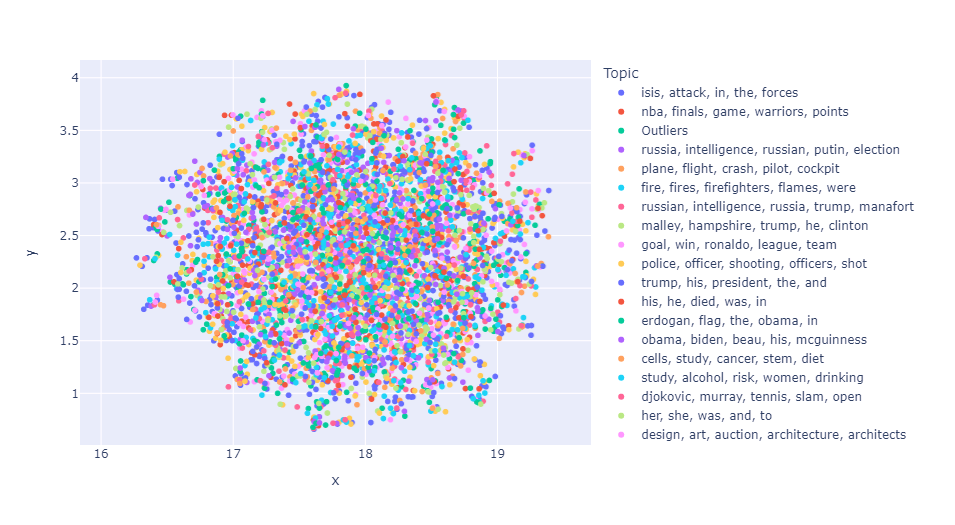

# CNN Topic Modeling
This project aims to analyze and visualize the topics covered in CNN articles using the BERTopic model. The goal is to gain insights into the variety of subjects addressed by CNN and to showcase the effectiveness of topic modeling techniques.

## Dataset
The data used in this project consists of news articles from the **All The News** dataset. I filtered the dataset to retain only articles from CNN for the analysis.

## Methodology
- Load and preprocess the data, keeping only the articles from CNN.
- Create a BERTopic model using DistilBERT for embeddings.
- Fit the BERTopic model on the CNN articles and extract topics.
- Perform dimensionality reduction on the embeddings using UMAP to enable visualization of the topics.
- Visualize the topics using a heatmap and a scatter plot with the reduced embeddings from UMAP.

## Insights
Based on the generated topics, the following insights were derived:
- News content covers a wide range of topics, from politics and international relations to sports and natural disasters.
- Significant coverage is dedicated to both national and international events, reflecting the global nature of CNN's audience and interests.
- The topics reveal a focus on major personalities and figures, such as politicians, sports stars, and public figures.
- Health-related issues and studies are also a prevalent theme in the topics, showcasing the importance of health news and its impact on the general public.
- A variety of human interest stories and lighter topics are covered, such as architecture, fashion, and animal stories, providing a diverse mix of content for readers.

